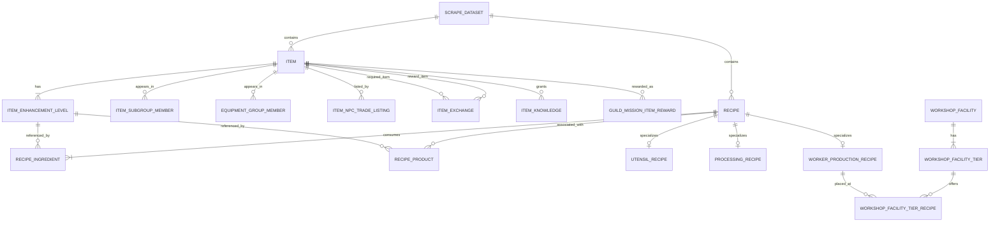

<Badge variant="warning">Design draft</Badge> <Badge>34 tables</Badge>
<Badge variant="accent">PostgreSQL / RDS</Badge>

This page defines the relational shape for the two public data products that the new scraper must reproduce.

<CardGroup cols={4}>
    <Card title="Dataset" icon="database">
        2 tables for immutable scrape versions and artifact provenance.
    </Card>
    <Card title="Items" icon="package">
        12 tables for item families and their public relationships.
    </Card>
    <Card title="Recipe core" icon="workflow">
        8 tables for the recipe union, ingredients, products, and result
        selectors.
    </Card>
    <Card title="Catalog support" icon="chart-bar">
        12 tables for facilities, guild production, nameable items, and mastery.
    </Card>
</CardGroup>

:::note[Scope]
The schema covers the `Item[]` returned by `src/scraper/scraper.ts` and the complete `RecipeCatalog` returned by `src/scraper/recipes.ts`. It does **not** model decoded input tables or standalone NPC, quest, localization, dialogue, expression, or node datasets.
:::

<Panel title="Primary shape evidence">
    The architecture follows the exported [item
    fields](../../bdo-scraper/src/scraper/scraper.ts#L140-L198), [recipe value
    objects](../../bdo-scraper/src/scraper/recipes.ts#L34-L129), and [recipe
    variants and catalog](../../bdo-scraper/src/scraper/recipes.ts#L131-L340).
</Panel>

## Storage conventions

- Every table is scoped by `dataset_id`. It is part of every primary and foreign key below, even when omitted from a column list for readability.
- A scrape creates an immutable dataset. Build it in a transaction, validate it, then mark it published. Queries select one published dataset explicitly.
- Exact unsigned 64-bit quantities use `NUMERIC(20,0)`. This includes recipe quantities, workloads, durations, silver costs, and trade value bands.
- Item prices fit the current JavaScript integer contract but should use non-negative `BIGINT`. Weight is stored as exact `weight_1e4_lt`; `weightLT` is projected as `weight_1e4_lt / 10000`.
- Percent values are stored as integer millionths. The API divides by `10_000` to reproduce the public percentage values.
- Optional enhancement levels are normalized to `0`. `(item_id, enhancement_level)` is the recipe/item identity.
- Every public array receives a zero-based position column, even when another natural key exists. This preserves exact output order and repeated occurrences.
- Strings already embedded in the final result remain on their owning row with an explicit source-locale column where applicable. There is no general localization schema in this data product.

:::info[Key notation]
**PK** means primary key, **FK** means foreign key, **UQ** means unique key, and `?` marks a nullable column.
:::

## Relationship overview

<Frame caption="Core item, recipe, and workshop relationships.">

</Frame>

## Dataset tables

| Table             | Key and columns                                                                                                                                    | Meaning                                                |
| ----------------- | -------------------------------------------------------------------------------------------------------------------------------------------------- | ------------------------------------------------------ |
| `scrape_dataset`  | **PK** `dataset_id`; **UQ** (`source_build`, `source_fingerprint`); `schema_version`, `scraper_git_commit`, `generated_at_utc`, `status`, `notes?` | One immutable version of both public data products.    |
| `scrape_artifact` | **PK** (`dataset_id`, `artifact_kind`); `sha256`, `row_count`, `source_description`                                                                | Provenance and audit counts for `items` and `recipes`. |

## Item tables

The item root contains only attributes proven invariant across enhancement rows. Its public relationship collections are always present; an empty array means no relationship was found ([final item contract](../../bdo-scraper/src/scraper/scraper.ts#L140-L206)).

| Table                         | Key and columns                                                                                                                                                                                                                                                                                                                                                                 | Public projection                                                                                               |
| ----------------------------- | ------------------------------------------------------------------------------------------------------------------------------------------------------------------------------------------------------------------------------------------------------------------------------------------------------------------------------------------------------------------------------- | --------------------------------------------------------------------------------------------------------------- |
| `item`                        | **PK** `item_id`; **UQ** `catalog_position`; `max_enhancement_level`, `item_type_code`, `item_classify_code`, `item_grade_code`, `equip_type_code`, `equip_slot_code`, `is_stackable`, `applies_directly`, `vesting_type_code`, `is_user_vested`, `is_tradeable`, `trade_type_code`, `is_cash`, `is_personal_trade`, `weight_1e4_lt`, `buy_price`, `sell_price`, `repair_price` | One `Item`. `catalog_position` reconstructs the returned `Item[]` order.                                        |
| `item_enhancement_level`      | **PK** (`item_id`, `enhancement_level`); **UQ** (`item_id`, `position`); `position`; **FK** `item_id -> item`                                                                                                                                                                                                                                                                   | `enhancementLevels[]`, strictly increasing and non-empty.                                                       |
| `item_market_search_entry`    | **PK** (`item_id`, `position`); `search_text_ko`; **FK** `item_id -> item`                                                                                                                                                                                                                                                                                                      | `marketSearchEntries[]`. Do not collapse the public array to a nullable column.                                 |
| `item_market_price_reference` | **PK/FK** `item_id -> item`; **FK** `market_item_id -> item`                                                                                                                                                                                                                                                                                                                    | Optional `marketPriceReferenceItemId`. It is an identity link, not a live price.                                |
| `item_subgroup_member`        | **PK** (`item_id`, `membership_position`); **UQ** (`subgroup_id`, `member_position`); **FK** (`item_id`, `enhancement_level`) -> `item_enhancement_level`; `subgroup_id`, `member_position`, `trade_base_value?`, `trade_lower_value?`, `trade_upper_value?`                                                                                                                    | One `subgroupMemberships[]` entry and its optional `tradeValueBand`.                                            |
| `item_subgroup_main_group`    | **PK** (`subgroup_id`, `position`); `main_group_id`, `condition_expression`                                                                                                                                                                                                                                                                                                     | Normalized copy of each membership's ordered `mainGroups[]`. The same subgroup rules are shared by all members. |
| `equipment_group_member`      | **PK** (`item_id`, `membership_position`); **UQ** (`equipment_group_id`, `member_position`); `equipment_group_id`, `member_position`; **FK** `item_id -> item`                                                                                                                                                                                                                  | `equipmentGroupMemberships[]`.                                                                                  |
| `item_npc_trade_listing`      | **PK** (`item_id`, `position`); `npc_id`, `namespace_code`; **FK** `item_id -> item`                                                                                                                                                                                                                                                                                            | `npcTradeListings[]`. `npc_id` remains a scalar because no NPC catalog is part of this output.                  |
| `item_exchange`               | **PK** `exchange_id`; `catalog_position`; **FKs** `required_item_id -> item`, `reward_item_id -> item`; `required_quantity`, `reward_quantity`                                                                                                                                                                                                                                  | One normalized exchange. The per-item `role` is derived by which FK matches the queried item.                   |
| `item_exchange_display`       | **PK** (`exchange_id`, `position`); `character_key`, `display_group_id`; **FK** `exchange_id -> item_exchange`                                                                                                                                                                                                                                                                  | Ordered `displays[]`. `character_key` remains a scalar.                                                         |
| `item_knowledge`              | **PK** (`item_id`, `position`); `knowledge_id`; **FK** `item_id -> item`                                                                                                                                                                                                                                                                                                        | Ordered `knowledgeIds[]`. No standalone knowledge table is required.                                            |
| `guild_mission_item_reward`   | **PK** (`item_id`, `position`); `guild_mission_id`, `amount`; **FK** `item_id -> item`                                                                                                                                                                                                                                                                                          | Ordered `guildMissionRewards[]`. No standalone mission table is required.                                       |

The item family/enhancement identity is a low-24-bit item ID plus high-byte enhancement level ([identity key](../../bdo-scraper/src/scraper/scraper.ts#L276-L285)). The scraper builds the root from enhancement rows, enforces invariant family fields, and validates the declared maximum ([assembly](../../bdo-scraper/src/scraper/scraper.ts#L407-L491)). It then joins subgroup, equipment, market, trade, exchange, knowledge, and reward relationships ([relationship assembly](../../bdo-scraper/src/scraper/scraper.ts#L493-L657)).

### Item cardinalities

- `item 1 -> 1..N item_enhancement_level`.
- `item 1 -> 0..N` market labels, subgroup memberships, equipment memberships, NPC listings, knowledge IDs, and guild mission rewards.
- `item 1 -> 0..1 item_market_price_reference` as the source; many source items may reference the same market item.
- `item_exchange N -> 1 item` in both required and reward roles, and `item_exchange 1 -> 0..N item_exchange_display`.
- `item_subgroup_main_group` is keyed by subgroup rather than member because the final builder computes one ordered rule list per subgroup and copies it into each member projection ([subgroup join](../../bdo-scraper/src/scraper/scraper.ts#L493-L530)).

## Recipe tables

`RecipeCatalog.recipes` is a discriminated union of utensil, Processing, and worker-production recipes. The catalog also carries facilities, nameable item IDs, and three mastery tracks ([catalog schema](../../bdo-scraper/src/scraper/recipes.ts#L261-L340)).

| Table                           | Key and columns                                                                                                                                                                                                                                                                                        | Public projection                                                                                                         |
| ------------------------------- | ------------------------------------------------------------------------------------------------------------------------------------------------------------------------------------------------------------------------------------------------------------------------------------------------------ | ------------------------------------------------------------------------------------------------------------------------- |
| `recipe`                        | **PK** `recipe_row_id`; **UQ** `catalog_position`; `recipe_kind`                                                                                                                                                                                                                                       | Common root for one `recipes[]` entry. `recipe_row_id` is dataset-local. `ingredientCount` is derived from child rows.    |
| `utensil_recipe`                | **PK/FK** `recipe_row_id -> recipe`; **UQ** (`profession`, `formula_fingerprint`); `profession` (`cooking`/`alchemy`), `language_code`, `formula_fingerprint`                                                                                                                                          | Utensil-only fields. The fingerprint hashes the canonical unordered ingredient multiset; current source language is `pt`. |
| `processing_recipe`             | **PK/FK** `recipe_row_id -> recipe`; `method`, `weather_requirement?`, `success_chance_millionths`                                                                                                                                                                                                     | Processing-only fields; public `profession` is the constant `processing`.                                                 |
| `worker_production_recipe`      | **PK/FK** `recipe_row_id -> recipe`; **UQ** `worker_recipe_id`; `korean_name`, `korean_description?`, `result_icon_path?`, `production_workload_milliseconds`, `daily_craft_limit?`, `guild_craft_object_id?`                                                                                          | Worker-only fields. `worker_recipe_id` is the public `recipeId`.                                                          |
| `recipe_result`                 | **PK/FK** `recipe_row_id -> recipe`; `normal_drop_group_id`, `lucky_drop_group_id?`, `quantity_kind`, `fixed_quantity?`, `quantity_source?`                                                                                                                                                            | Processing/worker `results` selector. Absent for utensil recipes.                                                         |
| `recipe_ingredient`             | **PK** (`recipe_row_id`, `position`); `item_id`, `enhancement_level`, `quantity`, `name?`, `icon_path?`, `metadata_locale_code?`; **FKs** to `recipe` and (`item_id`, `enhancement_level`) -> `item_enhancement_level`                                                                                 | Ordered `ingredients[]`. Name and icon are present together.                                                              |
| `recipe_product`                | **PK** (`recipe_row_id`, `position`); `item_id`, `enhancement_level`, `name?`, `icon_path?`, `description?`, `metadata_locale_code?`, `minimum_mastery?`, `quantity_kind`, `fixed_quantity?`, `quantity_source?`; **FKs** to `recipe` and (`item_id`, `enhancement_level`) -> `item_enhancement_level` | Utensil `knownProducts[]` or Processing/worker `results.knownProducts[]`.                                                 |
| `recipe_product_declared_skill` | **PK** (`recipe_row_id`, `product_position`, `position`); `skill_rank`, `skill_level`; **FK** to `recipe_product`                                                                                                                                                                                      | Utensil product `declaredSkillLevels[]`.                                                                                  |

### Recipe union constraints

- Every `recipe` has exactly one subtype row matching `recipe_kind`.
- `utensil_recipe` has no `recipe_result`; every utensil product has complete name/icon/description metadata and `server_defined / utensil_craft` quantity evidence ([utensil schema](../../bdo-scraper/src/scraper/recipes.ts#L123-L164)).
- `processing_recipe` has exactly one `recipe_result`, at least one ingredient, and zero or more known products ([Processing schema](../../bdo-scraper/src/scraper/recipes.ts#L166-L207)).
- `worker_production_recipe` has exactly one `recipe_result`, at least one ingredient, and optional placement/guild details ([worker schema](../../bdo-scraper/src/scraper/recipes.ts#L209-L259)).
- `quantity_kind = fixed` requires `fixed_quantity` and no source. `quantity_kind = server_defined` requires a source and no fixed quantity.
- Known products are associations supported by current client data; they are not necessarily complete or guaranteed. The scraper deliberately keeps product identity and quantity evidence separate ([catalog builder boundary](../../bdo-scraper/src/scraper/recipes.ts#L1613-L1620)).

### Workshop and guild production

| Table                                | Key and columns                                                                                                                                        | Public projection                                                                     |
| ------------------------------------ | ------------------------------------------------------------------------------------------------------------------------------------------------------ | ------------------------------------------------------------------------------------- |
| `workshop_facility`                  | **PK** `recipe_list_id`; `catalog_position`, `korean_name`, `workshop_subtype_code`, `storage_capacity?`                                               | One `workshopFacilities[]` entry.                                                     |
| `workshop_facility_tier`             | **PK** (`recipe_list_id`, `tier`); `position`, `upgrade_silver_cost?`, `conversion_time_seconds?`; **FK** `recipe_list_id -> workshop_facility`        | Ordered five-tier `tiers[]` and optional `upgradeRequirement`.                        |
| `workshop_facility_tier_recipe`      | **PK** (`recipe_list_id`, `tier`, `position`); **FKs** to `workshop_facility_tier` and `worker_recipe_id -> worker_production_recipe.worker_recipe_id` | Ordered tier `recipeIds[]`; also derives each worker recipe's `workshopPlacements[]`. |
| `workshop_facility_tier_guild_skill` | **PK** (`recipe_list_id`, `tier`, `position`); **FK** to `workshop_facility_tier`; `guild_skill_id`                                                    | Tier `requiredGuildSkillIds[]`.                                                       |
| `guild_recipe_production`            | **PK/FK** `recipe_row_id -> worker_production_recipe`; `category`, `production_time_seconds`, `instant_completion_silver_per_second`                   | Optional worker `guildProduction` object.                                             |
| `guild_recipe_eligible_character`    | **PK** (`recipe_row_id`, `position`); `guild_house_character_id`; **FK** `recipe_row_id -> guild_recipe_production`                                    | `eligibleGuildHouseCharacterIds[]`.                                                   |
| `guild_recipe_required_skill`        | **PK** (`recipe_row_id`, `position`); `guild_skill_id`; **FK** `recipe_row_id -> guild_recipe_production`                                              | `requiredGuildSkillIds[]`.                                                            |
| `nameable_crafted_item`              | **PK** (`position`); **UQ/FK** `item_id -> item`                                                                                                       | Top-level `nameableCraftedItemIds[]`.                                                 |

Facility data is stored once. The worker recipe's nested `workshopPlacements[]` is a denormalized public projection produced by joining the tier, facility, tier skill, and tier recipe tables. The legacy builder already constructs facilities and a `placementsByRecipeId` index from the same facts ([facility result](../../bdo-scraper/src/scraper/recipes.ts#L1270-L1277), [worker placement projection](../../bdo-scraper/src/scraper/recipes.ts#L1524-L1588)).

### Mastery

| Table                          | Key and columns                                                                                                                                                                                                                                     | Public projection              |
| ------------------------------ | --------------------------------------------------------------------------------------------------------------------------------------------------------------------------------------------------------------------------------------------------- | ------------------------------ |
| `processing_mastery`           | **PK** `position`; **UQ** `minimum_mastery`; `material_batch_count`, `better_grade_chance_millionths`                                                                                                                                               | `mastery.processing[]`.        |
| `cooking_mastery`              | **PK** `position`; **UQ** `minimum_mastery`; `product_amount_increase_millionths`, `byproduct_amount_increase_millionths`, `rare_product_amount_increase_millionths`, `mass_cooking_chance_millionths`, `imperial_delivery_silver_bonus_millionths` | `mastery.cooking[]`.           |
| `alchemy_mastery`              | **PK** `position`; **UQ** `minimum_mastery`; `product_amount_increase_millionths`, `imperial_delivery_silver_bonus_millionths`, `bonus_result_roll_chance_millionths`                                                                               | `mastery.alchemy[]`.           |
| `alchemy_mastery_bonus_result` | **PK** (`alchemy_mastery_position`, `position`); `result_group_id`, `conditional_chance_millionths`; **FK** to `alchemy_mastery`                                                                                                                    | Ordered `bonusResultGroups[]`. |

The public scraper converts source millionths into percentages while assembling these tracks ([mastery builder](../../bdo-scraper/src/scraper/recipes.ts#L1280-L1315)). Storing the integer source scale avoids floating-point loss while reproducing the same API values.

## Cross-product identity constraints

Recipe item words use the same 24-bit item ID and 8-bit enhancement representation as the item product ([recipe identity](../../bdo-scraper/src/scraper/recipes.ts#L34-L45)). Ingredients and products therefore have hard composite FKs to `item_enhancement_level`, while nameable items have a hard FK to `item`. Omitted recipe enhancement levels are persisted as `0` before FK validation.

The committed legacy [item](../../bdo-scraper/items.json) and [recipe](../../bdo-scraper/recipes.json) snapshots currently resolve all 25,166 ingredient occurrences, 9,415 known-product occurrences, and four nameable item IDs to exact item/enhancement rows. The importer must repeat this audit before publishing every new dataset; a missing identity is a failed scrape, not an external reference.

:::warning[External identifier boundary]
Do not invent parent tables for `npc_id`, `character_key`, `knowledge_id`, `guild_mission_id`, `guild_skill_id`, result-group IDs, or guild-house character IDs. They are scalar references in these public products, and their authoritative catalogs are out of scope.
:::

## Dataset-local recipe identity

Only worker-production recipes expose a stable source `recipeId`. Processing recipes have no public ID, and utensil formula identity is the profession plus an order-insensitive exact ingredient multiset. The final catalog concatenates utensil, Processing, and worker arrays in that order ([catalog assembly](../../bdo-scraper/src/scraper/recipes.ts#L1622-L1647)).

<Panel title="Identity rules">

- `recipe_row_id` is a generated database identity valid only inside one dataset;
- `catalog_position` is stored to reproduce `recipes[]` exactly;
- `formula_fingerprint` is SHA-256 over the length-safe canonical encoding of the sorted `(item_id, enhancement_level, quantity)` multiset, retaining duplicate tuples;
- `worker_recipe_id` is unique within the dataset and is used by workshop placement FKs; and
- no `recipe_row_id` may be treated as stable across game builds.

</Panel>

## Import lifecycle

<Steps>
    <Step title="Stage the dataset">
        Create an unpublished `scrape_dataset` and record both public artifacts.
    </Step>
    <Step title="Load items first">
        Insert item families, enhancement levels, and every item relationship
        before recipes establish item foreign keys.
    </Step>
    <Step title="Load the recipe catalog">
        Insert recipe roots and subtypes, then products, ingredients,
        facilities, guild production, nameable items, and mastery rows.
    </Step>
    <Step title="Validate and publish">
        Run all relationship, ordering, quantity-shape, and reconstruction
        checks in the same transaction before changing the dataset status to
        published.
    </Step>
</Steps>

## Required import validation

:::warning[Publication gate]
The dataset cannot be published unless every check below passes.
:::

- item IDs and `catalog_position` values are unique;
- each item has a non-empty, strictly increasing enhancement list ending at `max_enhancement_level`;
- invariant item fields and exact `weight_1e4_lt` agree across source enhancement rows;
- subgroup/equipment membership positions and exchange duplicates are conflict-free;
- market-price references resolve and are not self-references;
- every recipe has exactly one matching subtype and at least one ingredient;
- every recipe ingredient, known product, and nameable item resolves within the same item dataset;
- stored ingredient counts equal child row counts in the reconstructed output;
- ordered child positions are contiguous from zero;
- every quantity satisfies its fixed/server-defined discriminated shape;
- every workshop has exactly tiers 1 through 5 and every tier recipe resolves a worker recipe ID;
- each worker placement reconstructed from facility tables exactly matches the public nested placement;
- guild fixed product quantities agree with the corresponding product row; and
- all three mastery tracks are ordered by their validated source order/threshold.

The current acceptance tests are useful baselines for these audits, not permanent row-count constraints ([item acceptance](../../bdo-scraper/src/scraper/items.test.ts#L7-L58), [recipe acceptance](../../bdo-scraper/src/scraper/recipes.test.ts#L133-L227)).

260x110x50
2328137
