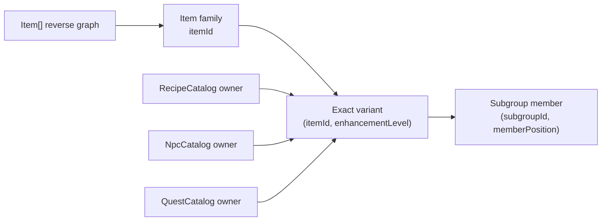

<Badge variant="accent">Final public aggregates</Badge>
<Badge>4 relationship owners</Badge>

This page documents item-to-entity relationships that survive into the final public `Item[]`, `RecipeCatalog`, `NpcCatalog`, and `QuestCatalog` outputs. Each exported schema is an interface boundary, and its aggregate builder is the authority for relationship ownership and semantics. The item scraper provides an item-owned reverse graph ([public item schemas](../../bdo-scraper/src/scraper/scraper.ts#L49-L206), [item aggregate builder](../../bdo-scraper/src/scraper/scraper.ts#L337-L665)); the other catalogs provide forward links owned by recipes, NPCs, quests, and guild missions.

:::note[Evidence boundary]
No relationship is inferred from a physical decoded-table layout. A parent is modeled only when it exists in one of the final public aggregates. Otherwise, its identifier remains an external scalar namespace.
:::

<CardGroup cols={3}>
    <Card title="Item family" icon="package">
        `itemId` is the canonical family identity. Most public relationships are
        family-scoped.
    </Card>
    <Card title="Exact enhancement" icon="layers">
        `(itemId, enhancementLevel)` identifies a represented enhancement
        variant. Subgroup membership is enhancement-scoped.
    </Card>
    <Card title="Relationship owner" icon="network">
        `Item[]` owns reverse projections; recipe, NPC, and quest records own
        their forward item links. Similar payloads are not automatically the
        same relation.
    </Card>
</CardGroup>

## Identity boundary

<Frame caption="Identity and ownership must both survive the relational projection.">

</Frame>

The scraper builds a map by `itemId` and a second map by the composite item/enhancement key. It rejects duplicate exact keys and validates that the represented levels are strictly increasing and end at the declared maximum ([key construction](../../bdo-scraper/src/scraper/scraper.ts#L276-L299), [family assembly](../../bdo-scraper/src/scraper/scraper.ts#L407-L491)).

:::warning[Do not collapse the two identities]
An `itemId` identifies a family; `(itemId, enhancementLevel)` identifies an exact variant. Within `Item[]`, only subgroup membership selects an exact variant. Recipe, NPC, and quest forward links can also carry enhancement. Never silently join a family-scoped reverse projection to an enhancement-scoped forward relation.
:::

## `Item[]` reverse relationship matrix

| Public field path                    | Target identity                                                    | Direction from public item                 | Cardinality                                            | Scope                                     |
| ------------------------------------ | ------------------------------------------------------------------ | ------------------------------------------ | ------------------------------------------------------ | ----------------------------------------- |
| `enhancementLevels[]`                | `enhancementLevel`; exact identity is `(itemId, enhancementLevel)` | family supports variant                    | `1..N`                                                 | exact enhancement                         |
| `subgroupMemberships[]`              | occurrence `(subgroupId, memberPosition)`                          | exact variant belongs to subgroup          | `0..N`                                                 | exact enhancement                         |
| `subgroupMemberships[].mainGroups[]` | rule `(mainGroupId, conditionExpression)`                          | subgroup is selected by main group rule    | `0..N` per membership                                  | subgroup rule copied into item projection |
| `equipmentGroupMemberships[]`        | occurrence `(equipmentGroupId, memberPosition)`                    | family belongs to equipment group          | `0..N`                                                 | item family                               |
| `marketSearchEntries[]`              | market-search entry for this `itemId`                              | family appears in local search list        | `0..N` by schema; current builder enforces at most one | item family                               |
| `marketPriceReferenceItemId`         | another `itemId`                                                   | non-market family references market family | `0..1`                                                 | item family to item family                |
| `npcTradeListings[]`                 | external `npcId` plus `namespaceCode`                              | family appears in NPC trade list           | `0..N`                                                 | item family                               |
| `exchangeRecipes[]`                  | `exchangeId` with required and reward `itemId` endpoints           | family participates as required or reward  | `0..N`                                                 | item family                               |
| `exchangeRecipes[].displays[]`       | external `(characterKey, displayGroupId)`                          | display location exposes exchange          | `0..N` per exchange                                    | external character/display namespace      |
| `knowledgeIds[]`                     | external `knowledgeId`                                             | family is a learning source for knowledge  | `0..N`                                                 | item family                               |
| `guildMissionRewards[]`              | external `guildMissionId` reward occurrence                        | mission awards family                      | `0..N`                                                 | item family                               |

## Forward catalog relationship matrix

| Owner                          | Public field path                                                             | Direction                                          | Item identity                             | Cardinality               |
| ------------------------------ | ----------------------------------------------------------------------------- | -------------------------------------------------- | ----------------------------------------- | ------------------------- |
| `RecipeCatalog` recipe         | `recipes[].ingredients[]`                                                     | recipe consumes item                               | exact variant; omitted enhancement is `0` | `1..N` per recipe         |
| `RecipeCatalog` recipe         | `recipes[].knownProducts[]`                                                   | utensil recipe is associated with known product    | exact variant; omitted enhancement is `0` | `1..N` per utensil recipe |
| `RecipeCatalog` recipe         | `recipes[].results.knownProducts[]`                                           | processing or worker recipe has known product      | exact variant; omitted enhancement is `0` | `0..N` per recipe         |
| `RecipeCatalog` root           | `nameableCraftedItemIds[]`                                                    | catalog marks item family as nameable when crafted | family                                    | `0..N` per catalog        |
| `NpcCatalog` NPC service       | `npcs[].services[].inventory[].items[]`                                       | inventory section offers or handles item           | exact variant                             | `1..N` per section        |
| `NpcCatalog` NPC               | `npcs[].rental.item`                                                          | NPC rents item                                     | exact variant                             | `0..1` per NPC            |
| `NpcCatalog` NPC               | `npcs[].tradeItemsHandled[]`                                                  | NPC handles trade item                             | base variant `(itemId, 0)`                | `0..N` per NPC            |
| `NpcCatalog` NPC               | `npcs[].exchanges[].requiredItem` / `.rewardItem`                             | NPC exchange consumes and awards items             | base variant `(itemId, 0)`                | `0..N` exchanges per NPC  |
| `NpcCatalog` NPC               | `npcs[].favoriteGifts[].item`                                                 | NPC favors gift item                               | base variant `(itemId, 0)`                | `0..N` per NPC            |
| `QuestCatalog` quest condition | `quests[].availability.calls[].target` / `quests[].completion.calls[].target` | expression call tests or refers to item            | family                                    | `0..1` target per call    |
| `QuestCatalog` ordinary quest  | `quests[].rewards.guaranteed[]`, `.selectableItems[]`, `.seasonItems[]`       | quest awards item                                  | exact variant                             | `0..N` per reward bucket  |
| `QuestCatalog` guild mission   | `guildMissions[].completion.calls[].target`                                   | completion call tests or refers to item            | family                                    | `0..1` target per call    |
| `QuestCatalog` guild mission   | `guildMissions[].itemRewards[]`                                               | guild mission awards item                          | exact variant                             | `0..N` per mission        |

:::info[Ownership rule]
The path owner is the relationship owner. An item can appear in several catalogs without receiving a single merged “usage” relation. Preserve the recipe/NPC/quest parent key, the public field or role, exact item identity, payload, and position.
:::

## `Item[]` collection semantics

All relationship collections are initialized on every item builder and validated as arrays in the final `Item.parse` call. A collection is therefore never `null` or omitted; only `marketPriceReferenceItemId` is optional ([builder initialization](../../bdo-scraper/src/scraper/scraper.ts#L429-L443), [final projection](../../bdo-scraper/src/scraper/scraper.ts#L659-L664)).

<Panel title="Ordering and duplicate policy">

- Array order is the builder's append order. A relational projection needs an explicit zero-based position for every public array.
- An occurrence must not be deduplicated unless the builder itself proves uniqueness. Equal payloads can represent separate source occurrences.
- Nested main-group rules are deliberately repeated in every public subgroup membership. A relational database may normalize them by `subgroupId`, then reproduce the nested array when projecting `Item`.
- An exchange is deliberately copied into both participating item records with different roles. A relational database should store the exchange once and derive each item's role.

</Panel>

An empty collection means that the loaded source data contributed no matching relationship to this aggregate. It does not prove that the relationship is impossible in all game systems or future builds.

## Enhancement levels

**Public field:** `enhancementLevels[]`

| Property    | Contract                                                                                                                                              |
| ----------- | ----------------------------------------------------------------------------------------------------------------------------------------------------- |
| Target      | Enhancement level within the containing `itemId`; exact identity is `(itemId, enhancementLevel)`.                                                     |
| Direction   | Item family **supports** exact enhancement variant.                                                                                                   |
| Cardinality | One or more per item.                                                                                                                                 |
| Payload     | Non-negative numeric level only. `maxEnhancementLevel` is the final level repeated as a root invariant.                                               |
| Ordering    | The builder sorts levels numerically ascending before final validation.                                                                               |
| Duplication | Duplicate `(itemId, enhancementLevel)` keys throw.                                                                                                    |
| Absence     | Impossible in a valid `Item`; the schema requires a non-empty list.                                                                                   |
| Validation  | Exact keys are unique; levels must increase strictly; the last level must equal `maxEnhancementLevel`; nonzero maxima require a matching declaration. |

The schema and refinement encode the public list and maximum invariant ([item schema](../../bdo-scraper/src/scraper/scraper.ts#L140-L147), [refinement](../../bdo-scraper/src/scraper/scraper.ts#L199-L206)); the builder performs duplicate and maximum-source checks before parsing ([enhancement validation](../../bdo-scraper/src/scraper/scraper.ts#L465-L491)).

## Subgroups and nested main-group rules

### `subgroupMemberships[]`

| Property          | Contract                                                                                                                                        |
| ----------------- | ----------------------------------------------------------------------------------------------------------------------------------------------- |
| Target            | Ordered subgroup occurrence `(subgroupId, memberPosition)`.                                                                                     |
| Direction         | Exact item enhancement **belongs to** subgroup.                                                                                                 |
| Cardinality       | Zero or more per item family.                                                                                                                   |
| Enhancement scope | Exact: payload carries `enhancementLevel`, resolved with the containing `itemId`.                                                               |
| Payload           | `subgroupId`, `memberPosition`, `enhancementLevel`, nested `mainGroups[]`, and optional `tradeValueBand`.                                       |
| Ordering          | Appended while traversing subgroup rows and each group's member list; `memberPosition` is the member's zero-based position inside its subgroup. |
| Duplication       | No final-aggregate deduplication is performed. Preserve membership occurrences and their output order.                                          |
| Absence           | Empty means no captured subgroup member resolved to this item family.                                                                           |
| Validation        | Every member must resolve an existing exact `(itemId, enhancementLevel)` or scraping throws.                                                    |

The public shape requires the subgroup ID, member position, enhancement level, rules, and optional band ([subgroup schema](../../bdo-scraper/src/scraper/scraper.ts#L57-L78)). Exact-key resolution and append order are visible in the builder ([subgroup assembly](../../bdo-scraper/src/scraper/scraper.ts#L512-L531)).

### `subgroupMemberships[].mainGroups[]`

| Property          | Contract                                                                                                                                |
| ----------------- | --------------------------------------------------------------------------------------------------------------------------------------- |
| Target            | Main-group rule payload `(mainGroupId, conditionExpression)`.                                                                           |
| Direction         | Main group **selects** the membership's subgroup under the condition. The public item reaches the rule through its subgroup membership. |
| Cardinality       | Zero or more rules per subgroup membership.                                                                                             |
| Enhancement scope | The rule targets the subgroup, not one item enhancement. It is repeated under enhancement-scoped membership objects.                    |
| Payload           | External numeric `mainGroupId` and exact condition expression string.                                                                   |
| Ordering          | Preserves main-group row/entry traversal order for each subgroup.                                                                       |
| Duplication       | The same rule list is copied into every member of a subgroup. Normalize by subgroup only if projection restores that list.              |
| Absence           | Empty means the loaded main-group data contains no rule selecting that subgroup.                                                        |
| Validation        | Every main-group entry must reference an existing subgroup; a missing subgroup throws.                                                  |

The rule shape and direction are explicit in the public schema ([main-group membership](../../bdo-scraper/src/scraper/scraper.ts#L43-L54)). The builder indexes ordered rules by subgroup and rejects missing subgroup references ([main-group join](../../bdo-scraper/src/scraper/scraper.ts#L493-L510)).

### `tradeValueBand`

`tradeValueBand` is payload on a subgroup membership, not another relationship. It is present only for a membership projected from the proven trade-member layout and contains exact unsigned 64-bit `baseValue`, `lowerValue`, and `upperValue` encoded as decimal strings. Non-trade memberships omit the object ([projection branch](../../bdo-scraper/src/scraper/scraper.ts#L302-L334)).

## Equipment groups

**Public field:** `equipmentGroupMemberships[]`

| Property          | Contract                                                                                     |
| ----------------- | -------------------------------------------------------------------------------------------- |
| Target            | Ordered occurrence `(equipmentGroupId, memberPosition)`.                                     |
| Direction         | Item family **belongs to** equipment group.                                                  |
| Cardinality       | Zero or more per family.                                                                     |
| Enhancement scope | Family-level; no enhancement level is carried.                                               |
| Payload           | `equipmentGroupId` and zero-based `memberPosition`.                                          |
| Ordering          | Appended in equipment-group traversal order; member position is preserved inside each group. |
| Duplication       | No final-aggregate deduplication. Preserve occurrences.                                      |
| Absence           | Empty means the loaded equipment groups do not contain the family.                           |
| Validation        | Every group member `itemId` must resolve an item family or scraping throws.                  |

The public relationship shape is defined at [equipment-group membership](../../bdo-scraper/src/scraper/scraper.ts#L80-L86), and the builder resolves every member before appending it ([equipment-group assembly](../../bdo-scraper/src/scraper/scraper.ts#L534-L545)).

## Market relationships

### `marketSearchEntries[]`

| Property          | Contract                                                                                       |
| ----------------- | ---------------------------------------------------------------------------------------------- |
| Target            | A local market-search entry owned by the same item family.                                     |
| Direction         | Item family **appears in** the installed client's market search list.                          |
| Cardinality       | Public schema: zero or more. Current builder: zero or one.                                     |
| Enhancement scope | Family-level.                                                                                  |
| Payload           | Exact Korean `searchTextKo`.                                                                   |
| Ordering          | Source traversal/append order; currently only one entry can survive.                           |
| Duplication       | A second source row for the same `itemId` throws.                                              |
| Absence           | Empty means omitted from this installed search list. It is not a universal no-trade assertion. |
| Validation        | Referenced item must exist; final text must be non-empty; duplicate item rows throw.           |

The field is an array in the public schema ([market entry](../../bdo-scraper/src/scraper/scraper.ts#L88-L92), [item field](../../bdo-scraper/src/scraper/scraper.ts#L182-L189)). The builder enforces the current one-row rule ([market assembly](../../bdo-scraper/src/scraper/scraper.ts#L548-L556)), and the installed-client test confirms market and linked-price population ([acceptance](../../bdo-scraper/src/scraper/items.test.ts#L7-L28)).

### `marketPriceReferenceItemId`

| Property          | Contract                                                                                                                             |
| ----------------- | ------------------------------------------------------------------------------------------------------------------------------------ |
| Target            | Another item family identified by `itemId`.                                                                                          |
| Direction         | Non-market source item **uses the market-price identity of** the target item.                                                        |
| Cardinality       | Zero or one target per source; many sources may share a target.                                                                      |
| Enhancement scope | Family-to-family.                                                                                                                    |
| Payload           | Target `itemId` only. No price value is present.                                                                                     |
| Ordering          | Not applicable; this is an optional scalar.                                                                                          |
| Duplication       | A second source link for the same item throws.                                                                                       |
| Absence           | Omitted means no price-identity link was loaded; it does not state whether the item is market-listed. Consult `marketSearchEntries`. |
| Validation        | Source and target items must exist; source must lack a market-search entry; target must have one.                                    |

These validation rules are enforced before the optional target ID is assigned ([price-reference assembly](../../bdo-scraper/src/scraper/scraper.ts#L558-L577)).

## NPC trade listings

**Public field:** `npcTradeListings[]`

| Property          | Contract                                                                                                                                                                     |
| ----------------- | ---------------------------------------------------------------------------------------------------------------------------------------------------------------------------- |
| Target            | External `npcId`; no NPC parent entity is included in `Item[]`.                                                                                                              |
| Direction         | Item family **appears in** NPC's detailed trade list.                                                                                                                        |
| Cardinality       | Zero or more listing occurrences per family.                                                                                                                                 |
| Enhancement scope | Family-level.                                                                                                                                                                |
| Payload           | `npcId` and `namespaceCode`.                                                                                                                                                 |
| Ordering          | Appended in detailed NPC row and entry traversal order.                                                                                                                      |
| Duplication       | Entry occurrences are preserved; the builder does not deduplicate equal item/NPC payloads.                                                                                   |
| Absence           | Empty means no loaded detailed trade list names the family.                                                                                                                  |
| Validation        | Each detailed NPC must exist in the compact trade-NPC set, each NPC has at most one detailed row, every trade item resolves, and every compact trade NPC has a detailed row. |

The public payload is defined at [NPC listing](../../bdo-scraper/src/scraper/scraper.ts#L94-L100). The complete-set and item-resolution checks are enforced during assembly ([NPC trade validation](../../bdo-scraper/src/scraper/scraper.ts#L579-L606)).

:::warning[External NPC namespace]
`npcId` is stored exactly as emitted. This aggregate does not contain an NPC record and does not prove that `npcId` is interchangeable with an exchange display's `characterKey`.
:::

## Item exchanges and display locations

### `exchangeRecipes[]`

| Property          | Contract                                                                                                                                                           |
| ----------------- | ------------------------------------------------------------------------------------------------------------------------------------------------------------------ |
| Target            | Exchange identity `exchangeId`, with required and reward item-family endpoints.                                                                                    |
| Direction         | Containing item **participates in** the exchange as `required` or `reward`.                                                                                        |
| Cardinality       | Zero or more per item family.                                                                                                                                      |
| Enhancement scope | Both exchange endpoints are item-family IDs; no enhancement level is present.                                                                                      |
| Payload           | `role`, `requiredItemId`, `requiredItemCount`, `rewardItemId`, `rewardItemCount`, and nested `displays[]`. Counts are exact unsigned 64-bit decimal strings.       |
| Ordering          | Exchange source traversal order per participating item.                                                                                                            |
| Duplication       | The same exchange payload is appended to both endpoint items with different roles. If both endpoints are the same family, both role occurrences remain meaningful. |
| Absence           | Empty means the family is not an endpoint of a loaded exchange recipe.                                                                                             |
| Validation        | Both endpoint item families must exist or scraping throws.                                                                                                         |

The complete public exchange object and role discriminator are defined at [exchange schema](../../bdo-scraper/src/scraper/scraper.ts#L102-L126). The builder creates one common payload, then appends required and reward projections separately ([exchange assembly](../../bdo-scraper/src/scraper/scraper.ts#L619-L638)).

### `exchangeRecipes[].displays[]`

| Property          | Contract                                                                                                                         |
| ----------------- | -------------------------------------------------------------------------------------------------------------------------------- |
| Target            | External display location `(characterKey, displayGroupId)`.                                                                      |
| Direction         | Character/display group **exposes** the containing exchange.                                                                     |
| Cardinality       | Zero or more locations per exchange.                                                                                             |
| Enhancement scope | Not item-scoped; it describes where the family-level exchange is displayed.                                                      |
| Payload           | `characterKey` and `displayGroupId`.                                                                                             |
| Ordering          | Preserves display row and exchange-ID traversal order for each `exchangeId`.                                                     |
| Duplication       | No final-aggregate deduplication is applied. Preserve locations as emitted.                                                      |
| Absence           | Empty is valid and means no display location was captured for that exchange.                                                     |
| Validation        | Locations are attached by `exchangeId`; display references without a captured exchange definition do not create an exchange row. |

The display payload is defined separately from the exchange endpoints ([display schema](../../bdo-scraper/src/scraper/scraper.ts#L102-L108)). The builder first indexes locations by `exchangeId`, then attaches only the locations found for each emitted recipe ([display join](../../bdo-scraper/src/scraper/scraper.ts#L608-L627)).

:::info[Relational projection]
Store one exchange row by `exchangeId`, two item-family foreign keys, and ordered display child rows. Derive the per-item `role` and duplicate nested JSON projection at the API boundary.
:::

## Knowledge IDs

**Public field:** `knowledgeIds[]`

| Property          | Contract                                                          |
| ----------------- | ----------------------------------------------------------------- |
| Target            | External `knowledgeId`; no knowledge parent entity is included.   |
| Direction         | Item family **is a learning source for** knowledge.               |
| Cardinality       | Zero or more per family.                                          |
| Enhancement scope | Family-level.                                                     |
| Payload           | Numeric knowledge ID only.                                        |
| Ordering          | Relationship traversal/append order.                              |
| Duplication       | No final-aggregate deduplication. Preserve the emitted sequence.  |
| Absence           | Empty means no loaded item-source relationship names the family.  |
| Validation        | Every relationship's source item must resolve or scraping throws. |

The public item schema exposes the IDs directly ([item field](../../bdo-scraper/src/scraper/scraper.ts#L190-L197)); assembly resolves the source item before appending the external ID ([knowledge join](../../bdo-scraper/src/scraper/scraper.ts#L640-L644)).

## Guild mission rewards

**Public field:** `guildMissionRewards[]`

| Property          | Contract                                                                                                           |
| ----------------- | ------------------------------------------------------------------------------------------------------------------ |
| Target            | Reward occurrence owned by external `guildMissionId`; no mission parent entity is included.                        |
| Direction         | Guild mission **awards** the item family.                                                                          |
| Cardinality       | Zero or more occurrences per family.                                                                               |
| Enhancement scope | Family-level; the public reward carries no enhancement level.                                                      |
| Payload           | `guildMissionId` and positive `amount`.                                                                            |
| Ordering          | Mission and reward traversal/append order.                                                                         |
| Duplication       | Reward occurrences are preserved. Do not collapse equal mission/item payloads without proof.                       |
| Absence           | Empty means no loaded guild mission reward block awards the family. It does not mean no ordinary quest rewards it. |
| Validation        | Every reward item must resolve; final schema requires a positive amount.                                           |

The relationship payload and positive amount are part of the public schema ([guild reward](../../bdo-scraper/src/scraper/scraper.ts#L128-L134)). The builder resolves every reward item before appending the mission occurrence ([guild reward join](../../bdo-scraper/src/scraper/scraper.ts#L646-L656)).

## `RecipeCatalog`-owned item links

<Badge variant="accent">Owner: recipe or catalog root</Badge>

Recipe item identities use a positive 24-bit `itemId`; an omitted `enhancementLevel` means base level `0`, while a present level is `1..255` ([recipe item identity](../../bdo-scraper/src/scraper/recipes.ts#L34-L45)). This omission convention is part of the recipe API and must be normalized before joining exact item variants.

### `recipes[].ingredients[]`

| Property    | Contract                                                                                                                                                                                  |
| ----------- | ----------------------------------------------------------------------------------------------------------------------------------------------------------------------------------------- |
| Target      | Exact item variant `(itemId, enhancementLevel ?? 0)`.                                                                                                                                     |
| Direction   | Recipe **consumes** the ingredient item.                                                                                                                                                  |
| Cardinality | One or more ingredients per utensil, processing, or worker-production recipe.                                                                                                             |
| Payload     | Positive decimal-string `quantity`; optional `name` and `iconPath` occur together for processing/worker ingredients, while utensil ingredients require both.                              |
| Ordering    | Public ingredient order is emitted recipe order. For utensil recipes it is first-seen display order and explicitly excluded from formula identity.                                        |
| Duplication | Repeated exact identities are meaningful formula slots and quantities. Preserve each occurrence and position.                                                                             |
| Absence     | Impossible for a valid recipe; every recipe variant requires a non-empty ingredient array.                                                                                                |
| Validation  | Item IDs and enhancement levels obey `RecipeItemIdentity`; quantities are positive; utensil metadata conflicts throw. Builders emit `ingredientCount` from the physical ingredient count. |

The utensil contract explicitly defines formula identity as profession plus the unordered ingredient multiset while preserving first-seen public order and repeated identities ([utensil recipe](../../bdo-scraper/src/scraper/recipes.ts#L131-L164)). Processing and worker recipes expose the same ingredient ownership with their own recipe identities ([processing recipe](../../bdo-scraper/src/scraper/recipes.ts#L195-L207), [worker recipe](../../bdo-scraper/src/scraper/recipes.ts#L242-L259)).

### Known products

**Public fields:** `recipes[].knownProducts[]` for utensil recipes and `recipes[].results.knownProducts[]` for processing and worker-production recipes.

| Property    | Contract                                                                                                                                                                                                                                                    |
| ----------- | ----------------------------------------------------------------------------------------------------------------------------------------------------------------------------------------------------------------------------------------------------------- |
| Target      | Exact item variant `(itemId, enhancementLevel ?? 0)`.                                                                                                                                                                                                       |
| Direction   | Recipe **has a locally known product association**.                                                                                                                                                                                                         |
| Cardinality | Utensil recipes: one or more. Processing/worker recipes: zero or more.                                                                                                                                                                                      |
| Payload     | Optional localized metadata plus quantity evidence: either a positive fixed decimal string or a `server_defined` source. Utensil products can also carry declared skill levels and minimum Mastery.                                                         |
| Ordering    | Utensil and processing builders sort by `itemId`, then normalized enhancement. Worker recipes accumulate sorted normal and lucky result groups in selector order while suppressing repeated identities. Preserve emitted order; it is not outcome priority. |
| Duplication | Builders merge or reject duplicate exact product identities; store at most one product association per recipe and exact item variant.                                                                                                                       |
| Absence     | An empty processing/worker list means the installed client did not identify a product membership. It does not mean the recipe produces nothing. Utensil recipes require at least one known product.                                                         |
| Validation  | Conflicting metadata for the same exact product throws. A `server_defined` quantity records that the client lacks the conditional count rows; it is not zero or unknown identity.                                                                           |

:::warning[Known is not guaranteed]
For Cooking and Alchemy, `knownProducts` is explicitly role-neutral, locally known, and potentially incomplete. An entry can be ordinary, rare, failure, or byproduct output and carries no guarantee or probability ([utensil semantics](../../bdo-scraper/src/scraper/recipes.ts#L131-L160)). Do not turn this relation into `recipe_guaranteed_product`.
:::

Product quantity evidence is a discriminated union rather than a plain count ([product quantities](../../bdo-scraper/src/scraper/recipes.ts#L65-L101), [result selector](../../bdo-scraper/src/scraper/recipes.ts#L166-L177)). Result groups deduplicate exact product identities and sort each group ([result-group products](../../bdo-scraper/src/scraper/recipes.ts#L1035-L1084)); utensil products are likewise deduplicated and sorted ([utensil product assembly](../../bdo-scraper/src/scraper/recipes.ts#L700-L734)). Processing performs a final merged sort ([processing product assembly](../../bdo-scraper/src/scraper/recipes.ts#L1373-L1411)); worker recipes append unique products in normal-then-lucky group order ([worker product assembly](../../bdo-scraper/src/scraper/recipes.ts#L1511-L1523)).

### `nameableCraftedItemIds[]`

| Property          | Contract                                                                                              |
| ----------------- | ----------------------------------------------------------------------------------------------------- |
| Target            | Item family `itemId`.                                                                                 |
| Direction         | Recipe catalog **marks item family as nameable when crafted**.                                        |
| Cardinality       | Zero or more per catalog.                                                                             |
| Enhancement scope | Family-level; no enhancement level is present.                                                        |
| Payload           | Item ID only.                                                                                         |
| Ordering          | Preserves the nameable-item table's row order.                                                        |
| Duplication       | The aggregate maps rows directly and does not establish a uniqueness invariant. Preserve occurrences. |
| Absence           | Empty means no nameable crafted item IDs were emitted by the installed catalog.                       |
| Validation        | Each ID is a positive integer. The public catalog does not require a matching `Item[]` record.        |

This is a root-owned classification list, not a recipe output edge. The final builder copies it independently of `recipes[]` ([recipe catalog schema](../../bdo-scraper/src/scraper/recipes.ts#L332-L340), [catalog assembly](../../bdo-scraper/src/scraper/recipes.ts#L1622-L1647)).

:::note[Recipe exchange is a different domain term]
`Item[].exchangeRecipes[]` describes required/reward item exchange definitions. `RecipeCatalog.recipes[]` describes Cooking, Alchemy, Processing, and worker production. They share the word “recipe” but are not one relation and have different owners, identities, and quantity evidence.
:::

## `NpcCatalog`-owned item links

<Badge variant="accent">Owner: NPC, service, or inventory section</Badge>

Every NPC-side item value carries explicit `(itemId, enhancementLevel)` plus optional item-facing prices, weight, and localized name ([NPC item](../../bdo-scraper/src/scraper/npcs.ts#L52-L63)). The projector defaults omitted source enhancement to `0`, but optional metadata can remain absent when no matching item-enchantment row is found ([NPC item projector](../../bdo-scraper/src/scraper/npcs.ts#L879-L899)). A public NPC item reference therefore does not, by itself, prove a successful join to `Item[]`.

### Service inventory items

**Public field:** `npcs[].services[].inventory[].items[]`

| Property    | Contract                                                                                                                                         |
| ----------- | ------------------------------------------------------------------------------------------------------------------------------------------------ |
| Target      | Exact item variant `(itemId, enhancementLevel)`.                                                                                                 |
| Direction   | NPC service inventory section **contains** item.                                                                                                 |
| Cardinality | A service has zero or one inventory array; when present it has one or more sections, each with one or more items.                                |
| Payload     | Optional name, weight, NPC buy price, NPC sell price, and repair price. Section `availability` conditions the section, not the item identity.    |
| Ordering    | Preserve NPC service order, section order, and item order inside each section.                                                                   |
| Duplication | No public uniqueness invariant spans services or sections. Equal exact items in different positions remain distinct occurrences.                 |
| Absence     | Missing `inventory` means that service exposes no projected inventory. It is distinct from an inventory section with no items, which is invalid. |
| Validation  | Every referenced main group and subgroup must resolve before the section is built; items then retain their exact source identities.              |

The nesting and non-empty section/item constraints are public API semantics ([inventory section](../../bdo-scraper/src/scraper/npcs.ts#L65-L71), [NPC service](../../bdo-scraper/src/scraper/npcs.ts#L300-L320)). Group resolution and member order are enforced in the inventory projector ([inventory assembly](../../bdo-scraper/src/scraper/npcs.ts#L902-L928)).

### Rental item

**Public field:** `npcs[].rental.item`

| Property    | Contract                                                                                        |
| ----------- | ----------------------------------------------------------------------------------------------- |
| Target      | Exact item variant `(itemId, enhancementLevel)`.                                                |
| Direction   | NPC **rents** item.                                                                             |
| Cardinality | Zero or one rental per NPC.                                                                     |
| Payload     | `contributionCost`, `hasAdditionalRequirement`, and the NPC item metadata.                      |
| Ordering    | Not applicable; rental is an optional scalar object.                                            |
| Duplication | At most one rental object exists per NPC.                                                       |
| Absence     | Omitted when the compact NPC has rental item ID `0`.                                            |
| Validation  | A present rental requires positive contribution cost and rejects enhancement sentinel `0xffff`. |

The rental relationship is part of the NPC root schema ([NPC rental](../../bdo-scraper/src/scraper/npcs.ts#L396-L457)) and is constructed with an explicit enhancement level before its sentinel checks ([rental assembly](../../bdo-scraper/src/scraper/npcs.ts#L1407-L1419)).

### Trade items handled

**Public field:** `npcs[].tradeItemsHandled[]`

| Property    | Contract                                                                                                     |
| ----------- | ------------------------------------------------------------------------------------------------------------ |
| Target      | Base item variant `(itemId, 0)`.                                                                             |
| Direction   | NPC **handles** trade item.                                                                                  |
| Cardinality | Zero or more per NPC.                                                                                        |
| Payload     | NPC item metadata; no namespace code or listing-specific payload is retained.                                |
| Ordering    | First occurrence order from that NPC's trade entries.                                                        |
| Duplication | Builder deduplicates by `tradeItemId` before projection.                                                     |
| Absence     | Empty means the NPC has no emitted trade items in `NpcCatalog`.                                              |
| Validation  | The final `NpcItem` schema validates the identity; optional enrichment does not require a matching item row. |

The final NPC assembly applies `uniqueBy(...tradeItemId)` and calls the item projector without an enhancement argument, producing level `0` ([trade item assembly](../../bdo-scraper/src/scraper/npcs.ts#L1377-L1382)).

### Exchange endpoint items

**Public fields:** `npcs[].exchanges[].requiredItem` and `npcs[].exchanges[].rewardItem`

| Property    | Contract                                                                                                                                                                     |
| ----------- | ---------------------------------------------------------------------------------------------------------------------------------------------------------------------------- |
| Target      | Base item variants `(requiredItem.itemId, 0)` and `(rewardItem.itemId, 0)`.                                                                                                  |
| Direction   | NPC exchange **requires** one item and **awards** the other.                                                                                                                 |
| Cardinality | Zero or more exchange objects per NPC; exactly one required and one reward endpoint per object.                                                                              |
| Payload     | Exact unsigned decimal-string `requiredQuantity` and `rewardQuantity`, plus optional NPC item metadata.                                                                      |
| Ordering    | First occurrence order of exchange IDs exposed by that NPC's display rows.                                                                                                   |
| Duplication | Source exchange IDs are deduplicated per NPC, but the public object drops `exchangeId`; equal endpoint/count objects can therefore remain observationally indistinguishable. |
| Absence     | Empty means no exposed exchange ID resolved to an exchange definition for that NPC.                                                                                          |
| Validation  | Both item objects and both decimal quantities pass `NpcExchange`; unresolved exchange IDs are filtered out during assembly.                                                  |

The public exchange intentionally contains no ID ([NPC exchange](../../bdo-scraper/src/scraper/npcs.ts#L387-L394)). Assembly deduplicates source IDs, filters unresolved definitions, and projects both endpoints at enhancement `0` ([NPC exchange assembly](../../bdo-scraper/src/scraper/npcs.ts#L1383-L1394)). A relational model needs an NPC-local output position even if it also stores a reconciled exchange identity.

### Favorite gift items

**Public field:** `npcs[].favoriteGifts[].item`

| Property    | Contract                                                           |
| ----------- | ------------------------------------------------------------------ |
| Target      | Base item variant `(itemId, 0)`.                                   |
| Direction   | NPC **favors** gift item.                                          |
| Cardinality | Zero or more gift occurrences per NPC.                             |
| Payload     | Unsigned `baseAmity` plus optional NPC item metadata.              |
| Ordering    | Preserves gift source order.                                       |
| Duplication | The builder performs no deduplication; preserve occurrences.       |
| Absence     | Empty means no favorite gift entries were emitted for the NPC.     |
| Validation  | Final schema validates item identity and non-negative `baseAmity`. |

The field is part of the NPC root ([favorite-gift schema](../../bdo-scraper/src/scraper/npcs.ts#L446-L457)) and is projected directly with the default base enhancement ([favorite-gift assembly](../../bdo-scraper/src/scraper/npcs.ts#L1395-L1399)).

## `QuestCatalog`-owned item links

<Badge variant="accent">Owner: ordinary quest or guild mission</Badge>

Quest condition targets are family-scoped references, while quest rewards split a packed key into exact `(itemId, enhancementLevel)` identity ([condition target](../../bdo-scraper/src/scraper/quests.ts#L31-L80), [item reward](../../bdo-scraper/src/scraper/quests.ts#L92-L101)). These are different relations even when they name the same item.

### Condition call item targets

**Public fields:** `quests[].availability.calls[].target`, `quests[].completion.calls[].target`, and `guildMissions[].completion.calls[].target` when `target.kind === "item"`.

| Property    | Contract                                                                                                                                                                         |
| ----------- | -------------------------------------------------------------------------------------------------------------------------------------------------------------------------------- |
| Target      | Item family `itemId`; no enhancement level is present.                                                                                                                           |
| Direction   | Quest or guild-mission condition call **tests or refers to** item. Exact gameplay meaning remains in `call.name`, `arguments`, `negated`, and the complete condition expression. |
| Cardinality | Zero or one typed target per call; zero or more item-target calls per condition. Ordinary availability/completion conditions are optional; guild-mission completion is required. |
| Payload     | Optional localized item name plus the surrounding call and expression payload.                                                                                                   |
| Ordering    | Preserve condition call order. It corresponds to parsed expression traversal, not a set of dependencies.                                                                         |
| Duplication | No deduplication. Repeated calls can have different operators, arguments, negation, or expression positions.                                                                     |
| Absence     | Missing target does not prove the call is unrelated to an item; only established call names with a positive integer first argument receive a typed item target.                  |
| Validation  | Item target IDs are positive. The recognized call names are `checkequipitem`, `exchangeitem`, `gatheritem`, `getitemcount`, and `useitem`.                                       |

The target resolver attaches item identity only for that explicit call-name set and a positive numeric first argument ([target resolution](../../bdo-scraper/src/scraper/quests.ts#L426-L493)). Ordinary quests expose optional availability and completion conditions ([quest schema](../../bdo-scraper/src/scraper/quests.ts#L201-L230)); guild missions expose a required completion condition ([guild mission schema](../../bdo-scraper/src/scraper/quests.ts#L293-L308)).

### Ordinary quest item rewards

**Public fields:** item members of `quests[].rewards.guaranteed[]`, plus all `quests[].rewards.selectableItems[]` and `quests[].rewards.seasonItems[]`.

| Property    | Contract                                                                                                                                                                                                                                                                                |
| ----------- | --------------------------------------------------------------------------------------------------------------------------------------------------------------------------------------------------------------------------------------------------------------------------------------- |
| Target      | Exact item variant `(itemId, enhancementLevel)`.                                                                                                                                                                                                                                        |
| Direction   | Ordinary quest **awards** item under the reward bucket's semantics.                                                                                                                                                                                                                     |
| Cardinality | Zero or more item rewards per bucket. `guaranteed[]` is a mixed item/non-item list; a player chooses exactly one `selectableItems[]` entry when non-empty; `seasonItems[]` is an additional seasonal track.                                                                             |
| Payload     | Positive `amount` and optional localized item name. The bucket is semantic payload and must be retained.                                                                                                                                                                                |
| Ordering    | Preserve each public array's emitted order. For guaranteed items, retain the position among non-item rewards, not merely an item-only position.                                                                                                                                         |
| Duplication | No final deduplication is applied. Equal exact item/amount occurrences in one or different buckets remain separate rewards.                                                                                                                                                             |
| Absence     | Empty means that bucket emitted no valid item reward. It says nothing about the other reward buckets.                                                                                                                                                                                   |
| Validation  | Packed item key uses low 24 bits for `itemId` and high 8 bits for enhancement; zero item IDs or zero amounts are omitted. Unsupported guaranteed reward types throw. A malformed selectable chain is rejected; a malformed or absent seasonal chain may produce an empty seasonal list. |

Bucket semantics are defined directly by `QuestRewards` ([reward groups](../../bdo-scraper/src/scraper/quests.ts#L156-L167)). Exact item projection and zero filtering happen in `itemReward` ([item reward projection](../../bdo-scraper/src/scraper/quests.ts#L567-L581)); guaranteed decoding preserves generated reward order ([guaranteed rewards](../../bdo-scraper/src/scraper/quests.ts#L620-L670)), while linked selectable/season rewards preserve their validated chain order ([linked item rewards](../../bdo-scraper/src/scraper/quests.ts#L673-L694)).

### Guild mission item rewards

**Public field:** `guildMissions[].itemRewards[]`

| Property    | Contract                                                                          |
| ----------- | --------------------------------------------------------------------------------- |
| Target      | Exact item variant `(itemId, enhancementLevel)`.                                  |
| Direction   | Guild mission **awards** item.                                                    |
| Cardinality | Zero or more reward occurrences per guild mission.                                |
| Payload     | Positive `amount` and optional localized item name.                               |
| Ordering    | Preserves guild mission reward order after zero entries are filtered.             |
| Duplication | No final deduplication. Preserve equal reward occurrences and their positions.    |
| Absence     | Empty means the mission emits no valid nonzero item reward.                       |
| Validation  | Uses the same packed item-key split and zero filtering as ordinary quest rewards. |

The guild mission owns the full enhancement-specific reward relation in `QuestCatalog` ([guild mission schema](../../bdo-scraper/src/scraper/quests.ts#L293-L308)). Its builder projects every valid source reward through the shared item-reward function ([guild mission assembly](../../bdo-scraper/src/scraper/quests.ts#L1106-L1128)).

## Overlapping forward and reverse projections

These public aggregates overlap in three places. They are reconciliation candidates, not permission to collapse identities or payload.

| Item-owned reverse projection  | Forward owner                  | Safe comparison                                                                                                                           | Information present on only one side                                                                                                                                                                                  |
| ------------------------------ | ------------------------------ | ----------------------------------------------------------------------------------------------------------------------------------------- | --------------------------------------------------------------------------------------------------------------------------------------------------------------------------------------------------------------------- |
| `Item[].npcTradeListings[]`    | `Npc[].tradeItemsHandled[]`    | Compare item family and a separately proven NPC identity mapping.                                                                         | Item side retains `namespaceCode` and `npcId`; NPC side owns `characterKey`, base enhancement, and optional item metadata. The public APIs do not prove `npcId === characterKey`.                                     |
| `Item[].exchangeRecipes[]`     | `Npc[].exchanges[]`            | Compare required/reward family IDs and decimal quantities only as a candidate, then reconcile through proven NPC/display source identity. | Item side retains `exchangeId`, role, and display `(characterKey, displayGroupId)`; NPC side owns placement under an NPC and exact base-item objects but drops `exchangeId`. Equal endpoint/count tuples can collide. |
| `Item[].guildMissionRewards[]` | `GuildMission[].itemRewards[]` | Compare `guildMissionId`, `itemId`, and `amount`, preserving occurrence positions.                                                        | Quest side retains enhancement and optional name; item side is family-scoped and cannot distinguish enhancement variants.                                                                                             |

:::warning[Lossy reverse projections]
The `Item[]` reverse graph is not a substitute for the owning catalog. In particular, its guild mission reward loses enhancement, its NPC trade listing uses a separate scalar namespace, and its exchange projection has a different identity/payload shape. Store the owner relation first; derive a reverse view only when the join has been proven.
:::

## Relational implementation checklist

<Steps>
    <Step title="Store owner and item identity">
        Give every relationship its public aggregate owner and store either
        family `item_id` or exact `(item_id, enhancement_level)` as documented.
        Do not require optional catalog enrichment to invent an `Item[]` match.
    </Step>
    <Step title="Preserve every array position">
        Store explicit output positions for all public arrays, including nested
        main-group rules, exchange displays, recipe slots, NPC inventories,
        condition calls, and mixed guaranteed reward arrays.
    </Step>
    <Step title="Reconcile only proven overlaps">
        Keep item-owned reverse rows distinguishable from recipe-, NPC-, quest-,
        and guild-mission-owned rows. Add cross-catalog keys only when namespace
        identity and lossless payload mapping have been demonstrated.
    </Step>
    <Step title="Reconstruct all four outputs">
        Project rows back into `Item[]`, `RecipeCatalog`, `NpcCatalog`, and
        `QuestCatalog`, preserving omitted fields, empty arrays, order,
        duplicate occurrences, decimal quantities, discriminated unions, and
        owner-specific roles; compare each aggregate exactly before publication.
    </Step>
</Steps>

<CardGroup cols={1}>
    <Card title="Database architecture" href="/database" icon="database">
        See the proposed PostgreSQL/RDS design for the `Item[]` and
        `RecipeCatalog` subset of these relationships.
    </Card>
</CardGroup>
